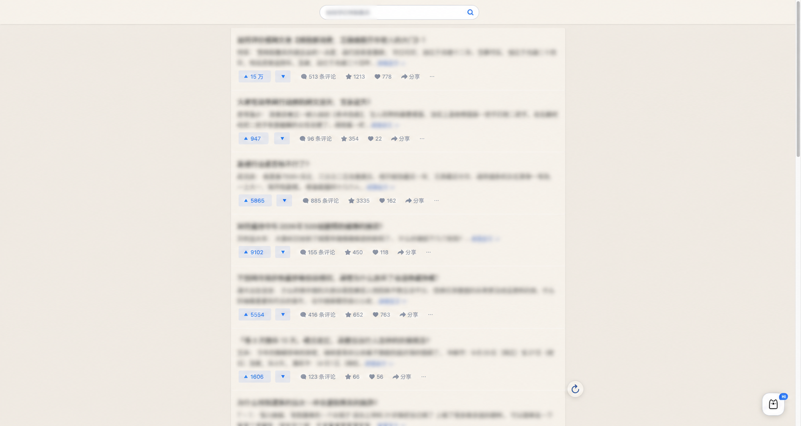
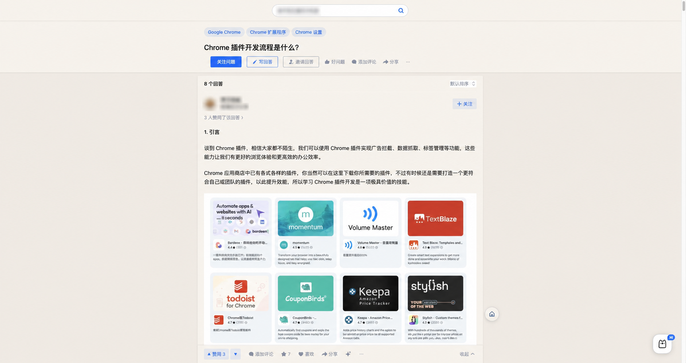
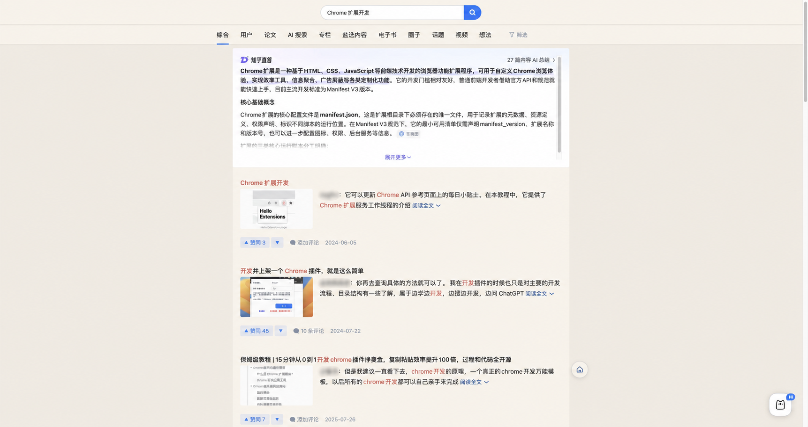
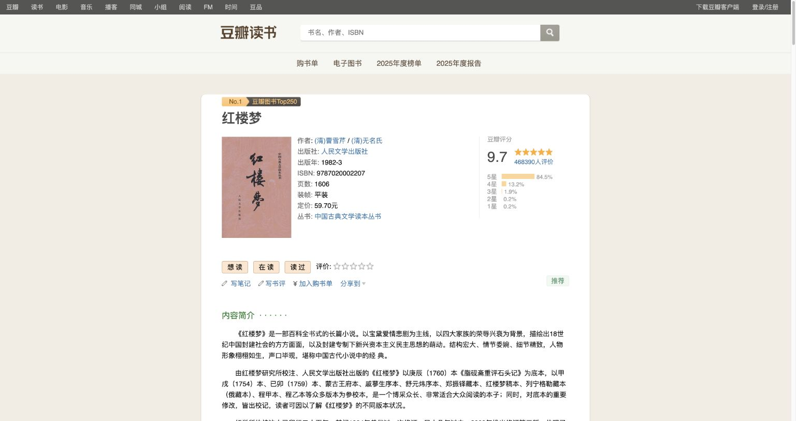
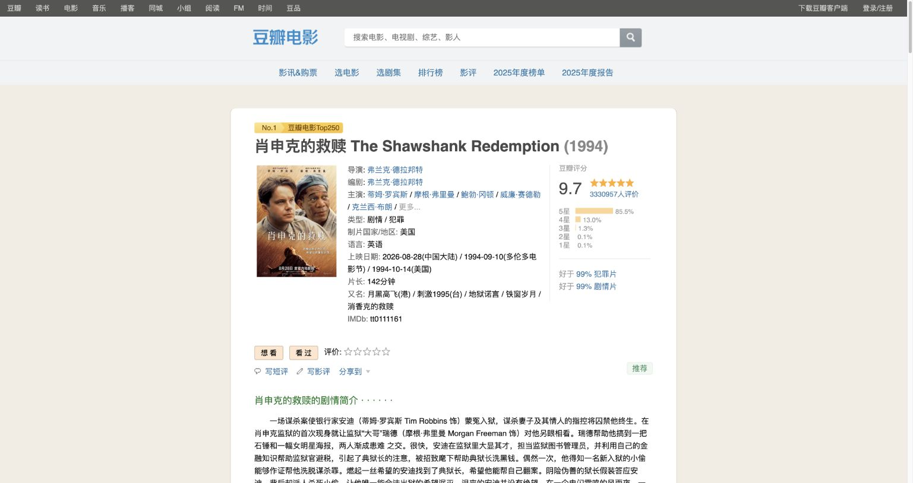

# ZhihuFocus

ZhihuFocus 是一个面向知乎与豆瓣的 Chrome 专注阅读扩展。它通过隐藏侧栏、广告及非核心模块，重新整理内容区域，并提供可同步的阅读外观设置，让页面更适合持续阅读。

## 页面预览

### 知乎首页

首页保留原始信息流宽度，并将内容居中；公开截图中的动态文本已做模糊处理。



### 知乎问题页

问题与回答主体居中显示，作者身份及无关搜索内容已做模糊处理。



### 知乎搜索页

搜索结果保持原有宽度与交互，作者身份已做模糊处理。



### 豆瓣图书条目页

《红楼梦》条目页隐藏右侧栏后，图书信息与简介在白色内容区域中居中显示。



### 豆瓣电影条目页

《肖申克的救赎》条目页保留豆瓣原始信息结构，并在主题背景中以居中的白色内容区域展示。



## 功能

- 一键开启或关闭专注模式，关闭后立即恢复网站原始布局。
- 居中知乎与豆瓣的主要内容，减少侧栏和广告干扰。
- 提供默认、暖纸、柔灰、护眼绿、雾蓝、淡紫灰六种浅色阅读主题。
- 提供夜墨（炭灰）、深海（深蓝）、暖夜（暖棕）三种深色主题，同时适配知乎、豆瓣的正文、导航、输入框和扩展设置面板。
- 默认跟随系统浅色 / 深色模式，系统切换后立即更新已打开的网页。浅色和深色主题分别记忆，也可固定使用浅色或深色。
- 支持调整正文字体、字号、行距、段距和内容宽度。
- 知乎首页支持只刷新中间信息流，不刷新整个页面。
- 知乎非首页页面提供快捷返回首页按钮。
- 豆瓣页面统一隐藏顶部站点导航，右下角保留首页和个人主页入口。
- 豆瓣搜索页将全部、电影、书籍、音乐横排显示；个人主页保留头像、栏目和收藏内容，并适配主题按钮。
- 设置保存在 `chrome.storage.sync`，可随同一 Google 账号同步到其他 Chrome 浏览器。

## 支持页面

### 知乎

- 首页：`https://www.zhihu.com/`
- 问题与回答页：`https://www.zhihu.com/question/*`
- 搜索页：`https://www.zhihu.com/search*`
- 人物页：`https://www.zhihu.com/people/*`
- 知乎专栏文章：`https://zhuanlan.zhihu.com/p/*`

### 豆瓣

- 豆瓣首页：`https://www.douban.com/`
- 豆瓣搜索页：`https://www.douban.com/search*`
- 豆瓣个人主页及其栏目：`https://www.douban.com/people/*`
- 豆瓣电影条目页：`https://movie.douban.com/subject/*`
- 豆瓣图书条目页：`https://book.douban.com/subject/*`
- 豆瓣影评页：`https://movie.douban.com/review/*`
- 豆瓣书评页：`https://book.douban.com/review/*`

豆瓣顶部导航隐藏和快捷入口覆盖 `https://*.douban.com/*`，包括音乐、小组等页面；登录及账号验证页面不注入扩展。上述页面经过主要布局适配，其他豆瓣页面使用通用样式。

## 安装

### Chrome Web Store

商店版本正在审核。审核通过后，可通过扩展 ID `gkmgpjmppdcghophgbemamlkobneiogm` 安装并自动接收更新。

### 本地安装

1. 下载或克隆本仓库。
2. 在 Chrome 地址栏打开 `chrome://extensions/`。
3. 开启右上角的“开发者模式”。
4. 点击“加载已解压的扩展程序”。
5. 选择本仓库根目录。

修改代码后，在扩展管理页点击 ZhihuFocus 的刷新按钮，再重新打开或刷新目标网页即可生效。

## 使用

点击 Chrome 工具栏中的 ZhihuFocus 图标，可以：

- 开启或关闭专注阅读。
- 选择跟随系统、固定浅色或固定深色，并更换当前模式的阅读主题。
- 调整知乎正文的字体、字号、行距、段距和内容宽度。
- 一键恢复默认外观设置。

豆瓣页面复用阅读主题（包括深色模式），但不会应用知乎的字体、字号、行距、段距和阅读宽度设置。

浅色、深色主题分别保存。跟随系统时，面板只显示当前模式可用的配色；系统模式改变后会自动恢复该模式上次选择的主题，无需刷新网页。升级会保留原有配色，恢复默认会重新启用系统跟随。

## 隐私

ZhihuFocus 不收集、出售或向外部服务器传输用户数据，也不使用远程代码。扩展仅使用 `storage` 权限保存和同步用户设置。完整说明见 [PRIVACY.md](PRIVACY.md)。

## 开发与检查

本项目不需要构建步骤或第三方运行时依赖。提交改动前可执行基础检查：

```bash
node --check shared/theme.js
node --check content/focus.js
node --check popup/popup.js
node --test tests/theme.test.cjs
python3 -m json.tool manifest.json >/dev/null
git diff --check
```

页面样式依赖网站当前 DOM；知乎或豆瓣改版后，部分选择器可能需要同步调整。

## 项目结构

```text
content/       页面脚本与知乎、豆瓣样式
icons/         扩展图标
popup/         扩展弹窗
shared/        弹窗与页面共用的主题逻辑
tests/         系统跟随与设置变更回归检查
store-assets/  Chrome Web Store 商品素材
manifest.json  Chrome Manifest V3 配置
PRIVACY.md     隐私说明
```
